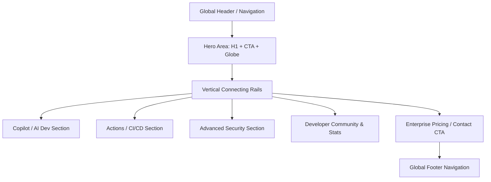

# GitHub Site Design Specification (DESIGN.md)

This document provides a comprehensive analysis of the design system, visual aesthetics, information architecture, interactive behaviors, and technical implementation of [GitHub.com](https://github.com). It serves as a guide for understanding the design philosophy and patterns that define the modern GitHub experience.

---

## 1. Product Identity & Value Proposition

### 1.1 Brand Purpose & Identity
GitHub is the world’s leading developer platform. Its design identity balances **professional-grade utility** (for daily coding and system management) with **high-impact, premium marketing visuals** (to attract enterprise buyers and inspire developers). 

The brand voice is:
*   **Inspirational yet Practical:** Bold declarations about the future of software combined with concrete, developer-centric features.
*   **AI-Forward:** Highlighting the transition to an "AI-powered SDLC" (Software Development Life Cycle) with Copilot and agentic workflows.
*   **Developer-First:** Clear, unbloated technical terminology, code snippets, and terminal inputs that establish immediate credibility.

### 1.2 Target Audience & Ideal Customer Profile (ICP)
1.  **Individual Developers & Open Source Contributors:** Require speed, clean utility, intuitive navigation, and reliable tool integrations.
2.  **Engineering Leaders & Managers:** Look for metrics, security controls, collaboration tools, and team velocity features.
3.  **Enterprise Executives & Buyers:** Seek security compliance, scalability, cost reduction, and AI-driven productivity gains.

### 1.3 Core User Journeys & Design Goals
*   **Discover & Explore:** Learn what GitHub offers through rich storytelling, high-fidelity interactive demos, and interactive customer showcases.
*   **Onboard & Convert:** Transition from curiosity to action via prominent, low-friction signup forms, clear pricing transparency, and instant codebase import.
*   **Collaborate & Code:** Maintain high productivity in code review (Pull Requests), project tracking (Projects), and automated delivery (Actions).

---

## 2. Visual Design Language

GitHub's visual identity relies on **Primer**, GitHub's open-source design system. The homepage, in particular, leverages the **Primer Brand** guidelines, which are specifically optimized for marketing, storytelling, and high-impact visual narratives.

### 2.1 Color Palette & System
The site uses a themeable color system designed to support both high-impact dark mode layouts (typically used for landing pages and the homepage) and standard light/dark modes for the app interface.

#### Base Theme (Dark Mode Primary)
| Variable Name | Hex Code | Visual Description / Role |
| :--- | :--- | :--- |
| `canvas-default` | `#0d1117` | Primary background color. |
| `canvas-subtle` | `#161b22` | Secondary/card background color. |
| `canvas-inset` | `#010409` | Darkest background; used for code boxes, search fields. |
| `border-default` | `#30363d` | Standard borders separating columns/components. |
| `border-muted` | `#21262d` | Subtle borders for secondary elements. |
| `fg-default` | `#f0f6fc` | Primary text color (high contrast white/off-white). |
| `fg-muted` | `#8b949e` | Secondary/body text (muted gray). |
| `fg-subtle` | `#484f58` | Subtext, placeholders, and disabled states. |

#### Accent & Semantic Colors
| Variable Name | Hex Code | Visual Description / Role |
| :--- | :--- | :--- |
| `accent-fg` | `#58a6ff` | Interactive links, active states, accent text. |
| `success-fg` | `#3fb950` | CTAs, success indicators, "Sign Up" button background. |
| `attention-fg` | `#d29922` | Warnings, intermediate status, pending checks. |
| `danger-fg` | `#f85149` | Error alerts, deleted lines, critical status. |
| `done-fg` | `#a371f7` | Merged Pull Requests, completed actions. |

#### Brand Gradients
GitHub utilizes glowing, space-inspired gradients on its marketing pages to signify innovation and AI integrations:
*   **Copilot Aurora:** Gradients blending Cyan (`#4facee`), Purple (`#8a63d2`), and Pink (`#ff5a9d`) to represent AI-guided developer intelligence.
*   **Actions Flow:** A vertical linear gradient transitioning from Blue (`#0969da`) to Purple (`#bc8cff`) to represent pipelines flowing smoothly.
*   **Ambient Glow:** Radial blurred overlays (e.g., opacity `0.15` cyan/purple blobs in the background) that break up flat blocks of color.

### 2.2 Typography System
The typography system prioritizes readability across multiple operating systems, falling back gracefully to system fonts while utilizing custom font families for display elements.

#### Font Families
*   **Sans-Serif (Default Interface & Body):** 
    ```css
    font-family: -apple-system, BlinkMacSystemFont, "Segoe UI", "Noto Sans", Helvetica, Arial, sans-serif, "Apple Color Emoji", "Segoe UI Emoji";
    ```
*   **Monospace (Code & Terminal Elements):**
    ```css
    font-family: ui-monospace, SFMono-Regular, "SF Mono", Menlo, Consolas, "Liberation Mono", monospace;
    ```
*   **Display (Headings & Large Marketing Text):**
    GitHub uses its proprietary **GitHub Sans** (or high-weight sans-serif system alternatives) to provide a clean, modern aesthetic with geometric characteristics.

#### Typography Scale (Marketing & Product Pages)
*   **Hero Heading:** `font-size: 72px` to `80px` (responsive to `48px` on mobile), `font-weight: 800`, `line-height: 1.1`, `letter-spacing: -0.02em`.
*   **Section Heading (H2):** `font-size: 48px` (responsive to `32px` on mobile), `font-weight: 700`, `line-height: 1.2`.
*   **Subheading (H3):** `font-size: 24px` to `32px`, `font-weight: 600`, `line-height: 1.3`.
*   **Body Copy (Large):** `font-size: 20px`, `font-weight: 400`, `line-height: 1.5`, `color: var(--fg-muted)`.
*   **Body Copy (Default):** `font-size: 16px`, `font-weight: 400`, `line-height: 1.5`, `color: var(--fg-muted)`.
*   **Mono Text:** `font-size: 14px`, `line-height: 1.45`, `letter-spacing: 0`.

### 2.3 Spacing & Grid System
*   **Baseline Grid:** Built on a `4px`/`8px` incremental system. All padding, margin, and layout gaps use multiples of `8px` (`8px`, `16px`, `24px`, `32px`, `48px`, `64px`, `96px`, `128px`).
*   **Page Container:** Maximum width of `1280px` for standard content, centered with auto-margins and padding of `16px` (mobile) to `32px` (desktop) on left/right edges.
*   **Grid Layouts:** CSS Grid is heavily utilized for content layouts, switching from single-column on mobile viewport dimensions to `2-column` or `3-column` layouts on desktop.
*   **Responsive Breakpoints:**
    *   Small (Mobile): `< 544px`
    *   Medium (Tablet): `544px` to `768px`
    *   Large (Desktop): `768px` to `1012px`
    *   Extra-Large (Wide Screen): `> 1012px` and `> 1280px`

### 2.4 Iconography & Visual Assets
*   **Octicons:** GitHub's bespoke SVG icon library.
    *   **Style:** Flat, clean, single-path SVGs designed on a `16px` and `24px` grid.
    *   **Aesthetics:** Squared corners, consistent line weights (`1.5px` or `2px`), and simple shapes to guarantee clarity at small sizes.
*   **Visual Assets:** High-fidelity SVGs, 3D WebGL renders (such as the interactive globe), and light-up illustrations representing complex processes like workflow branching or vulnerability analysis.

---

## 3. Information Architecture & Page Layout



### 3.1 Global Navigation
*   **Layout:** Sticky/floating top header with a dark, semi-translucent background (`background-color: rgba(13, 17, 23, 0.7)`) and a background blur (`backdrop-filter: blur(12px)`).
*   **Elements (Left to Right):**
    *   GitHub Invertocat Logo (white SVG).
    *   Interactive dropdown navigation links: *Product*, *Solutions*, *Resources*, *Open Source*, *Pricing*.
    *   Global Search input (collapsible or activation via hotkey `/`).
    *   "Sign in" link (plain text hover state).
    *   "Sign up" button (hollow or filled contrast styling).

### 3.2 Hero Section
*   **Copywriting:**
    *   *Primary Headline:* Focuses on innovation and velocity (e.g., "Build what's next" or "Let's build from here").
    *   *Supporting Paragraph:* Captures the scale of the community (over 100M+ developers, 4M+ organizations) and AI support.
*   **Layout Structure:**
    *   **Left Column (60% width):** Headlines, supporting paragraph, and the main CTA block consisting of a dark email input field juxtaposed with a green "Sign up for GitHub" button, followed by secondary "Start a free enterprise trial" link.
    *   **Right Column (40% width):** Interactive 3D WebGL Globe showing global collaboration, network lines, and code commits floating across continents in real-time.

### 3.3 Product Feature Verticals
Each vertical (Copilot, Actions, Security, Codespaces) follows a repeating, structured visual narrative:
1.  **Connecting Line Entrance:** A thin, luminous timeline/rail scrolls down the left side, anchoring the user's scroll.
2.  **Section Header:** Large H2 text accompanied by a colored Octicon badge that represents the category (e.g., green check for Actions, purple spark for Copilot, pink shield for Security).
3.  **Core Feature Pitch:** Compelling copywriting explaining the "why" and metrics illustrating the value proposition (e.g., "55% faster coding with GitHub Copilot").
4.  **Interactive Sandbox / Demo Card:** Large visual container showcasing the product in action (e.g., animated code typing, workflow builder visualizer, or dependency graph tree).

### 3.4 Social Proof & Customer Showcases
*   **Logos Grid:** Monochrome list of Fortune 100 enterprise logos (e.g., Stripe, Pinterest, PG&E, Toyota) to project enterprise security and readiness.
*   **Customer Case Studies:** Rich testimonials featuring developer quotes, high-resolution employee headshots, and highlight metrics (e.g., "99% reduction in build times").

### 3.5 Global Footer
*   **Background:** Solid dark background (`#0d1117`) with top border separation (`#30363d`).
*   **Structure:** Six columns organizing footer navigation links:
    *   *Product:* Features, Security, Team, Enterprise, Customer Stories, Pricing, Resources.
    *   *Platform:* Developer API, Partners, Atom, Electron, GitHub Desktop.
    *   *Support:* Docs, Community Forum, Professional Services, Contact Support, Status.
    *   *Company:* About, Blog, Careers, Press, Shop.
    *   *Terms & Legal:* Terms, Privacy, Site Map, Cookies.
    *   *Socials:* Icons for Twitter/X, GitHub, YouTube, LinkedIn, Facebook.

---

## 4. Interactive UI Components & Animation Specifications

GitHub.com's marketing pages utilize premium visual interactions that keep the site feeling alive and technologically superior.

### 4.1 Real-Time 3D WebGL Globe
*   **Tech Stack:** Built using custom WebGL/Three.js scripts.
*   **Visual Style:** A stylized, translucent blue/gray sphere. Continents are defined by points of light rather than solid shapes.
*   **Behavior:**
    *   Slow, autonomous rotation on the Y-axis.
    *   Users can drag/swipe to rotate and explore specific geographical areas.
    *   Luminous arcs (bezier curves) shoot out between major global tech hubs to represent code distribution.
    *   Small floating tooltips display real-time commit data (e.g., "Developer in Tokyo pushed 14 commits to main").

### 4.2 Connective Rails / Scroll-Triggered Lines
*   **Visual Design:** A vertical line, `2px` wide, with a muted border color (`#30363d`).
*   **Interaction:** 
    *   As the user scrolls down the page, a gradient fill (representing "energy" or "light") matches the scroll position, animating down the line.
    *   Circular anchor nodes along the line light up with color accents as they enter the browser viewport.
*   **Implementation Note:** Uses the intersection observer API to track viewport positioning and interpolate gradient sizing.

### 4.3 Interactive Code Playground (Copilot Demo)
*   **Interface:** A mockup of a VS Code window containing a mock editor workspace.
*   **Animation Loop:**
    1.  *Trigger:* An input prompt is "typed" out character by character (e.g., `// function to calculate distance between two coordinates`).
    2.  *AI Generation:* A ghost-text suggestion appears in light gray, simulating Copilot's prompt autocomplete suggestion.
    3.  *Acceptance:* The developer hits `Tab`, and the text instantly completes, highlighting the accepted syntax in full color.
    4.  *Cycle:* Pauses for 3 seconds, clears, and repeats with a different coding language (e.g., Python, Go, TypeScript).

### 4.4 Tabbed Workspace (Actions / Security)
*   **Layout:** A sidebar menu representing different steps (e.g., *Build*, *Test*, *Deploy*) linked to a main panel displaying a corresponding terminal output or workflow graph.
*   **Hover/Focus States:** Tabs feature subtle left-border color changes and background opacity animations on hover. Active tabs receive a solid accent border and full text opacity.

---

## 5. SEO & Accessibility (A11y) Strategy

### 5.1 SEO Structure & Semantics
*   **Semantic HTML:** 
    *   One main `<h1>` per landing page containing core keywords (e.g., "GitHub: Let's build from here").
    *   Descriptive nested headers (`<h2>` for major sections, `<h3>` for feature callouts) to maintain semantic reading structure.
    *   `<section>`, `<article>`, and `<aside>` containers instead of nested generic `<div>` blocks.
*   **Metadata:**
    *   `<title>` elements containing primary keywords and platform branding.
    *   `<meta name="description">` containing compelling, conversion-focused summary copy.
    *   Open Graph tags (`og:title`, `og:description`, `og:image`, `og:url`) to ensure shared links display customized preview images on platforms like X/Twitter, Slack, and LinkedIn.
*   **Structured Data / Schema Markup:**
    *   JSON-LD schemas for `SoftwareApplication`, `Organization`, and `FAQ` to secure Google Rich Results (star ratings, site links, product search boxes).

### 5.2 Accessibility Compliance
GitHub implements accessibility as a core design requirement rather than an afterthought.
*   **Keyboard Navigability:** Standardized focus rings (blue accent borders with high contrast) highlight interactive elements when navigating using the `Tab` key.
*   **Color Contrast:** Text-to-background color contrast satisfies Web Content Accessibility Guidelines (WCAG) 2.1 AA compliance (ratio of at least `4.5:1` for regular text and `3:1` for large text).
*   **Screen Reader Friendly:** 
    *   Interactive custom elements feature accurate `aria-label`, `aria-expanded`, and `aria-controls` bindings.
    *   All SVGs and graphic illustrations utilize `role="img"` and contain `<title>` or `aria-label` declarations.
    *   Purely decorative visual elements are explicitly hidden from screen readers using `aria-hidden="true"`.

---

## 6. Technical Architecture & Performance

### 6.1 Frontend Stack & Design Tokens
*   **Component System:** Built primarily using React components (`@primer/react`) integrated with custom Web Components (using GitHub's own open-source framework, Catalyst).
*   **Styles:** Primer Brand CSS provides modular utility sheets that isolate marketing components from the core web app styles, keeping bundle sizes minimal.
*   **CSS Variables:** Core design tokens (spacing, fonts, colors, border-radius) are compiled as CSS variables at the `:root` level, enabling seamless theme switching.

### 6.2 Performance Optimizations
*   **Asset Lazy Loading:**
    *   Non-critical SVGs, background visual art, and customer logos are lazy loaded utilizing `loading="lazy"` attributes.
    *   3D WebGL assets are dynamically imported and initialized only when the user scrolls near the hero section, avoiding CPU bottlenecks during page load.
*   **Asset Optimization:**
    *   Visual graphics are delivered in next-gen `.webp` or `.avif` formats.
    *   SVG illustrations are minified, stripping out unused metadata and inline styling blocks.
*   **Caching & CDNs:** Assets are delivered via high-performance content delivery networks (CDNs) using optimized HTTP/2 and HTTP/3 multiplexing strategies to reduce latency globally.
